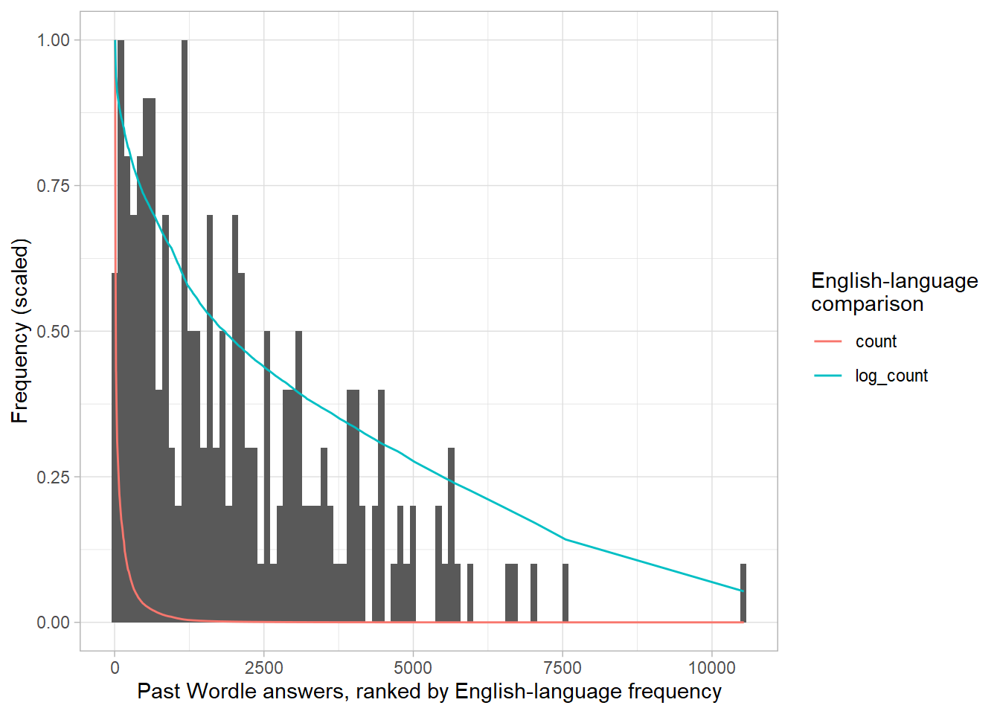
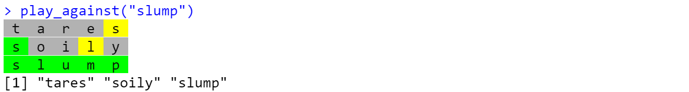
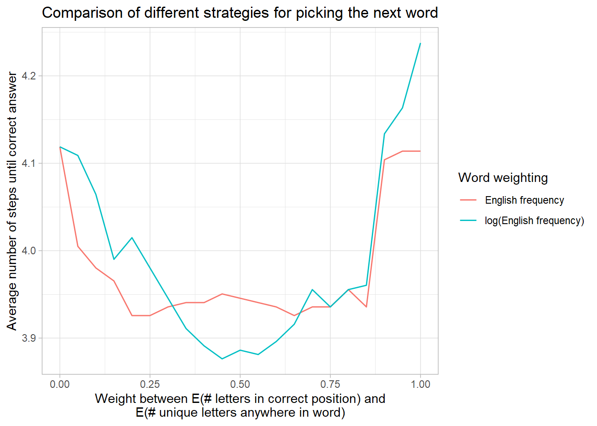
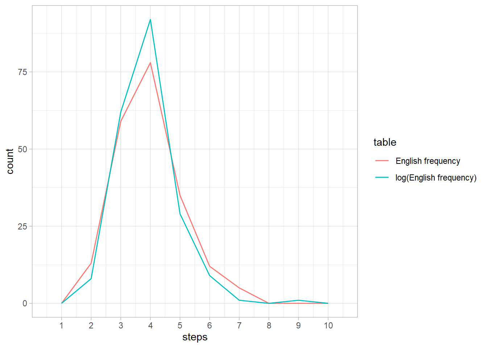
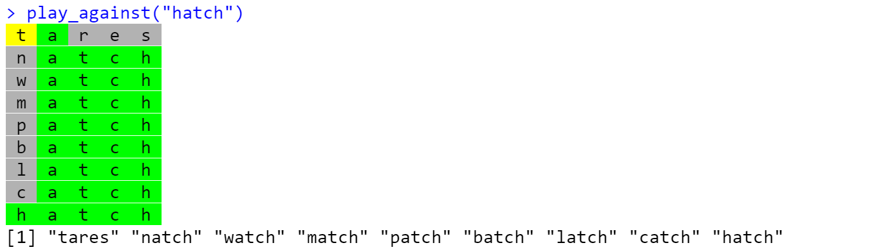
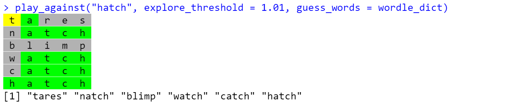
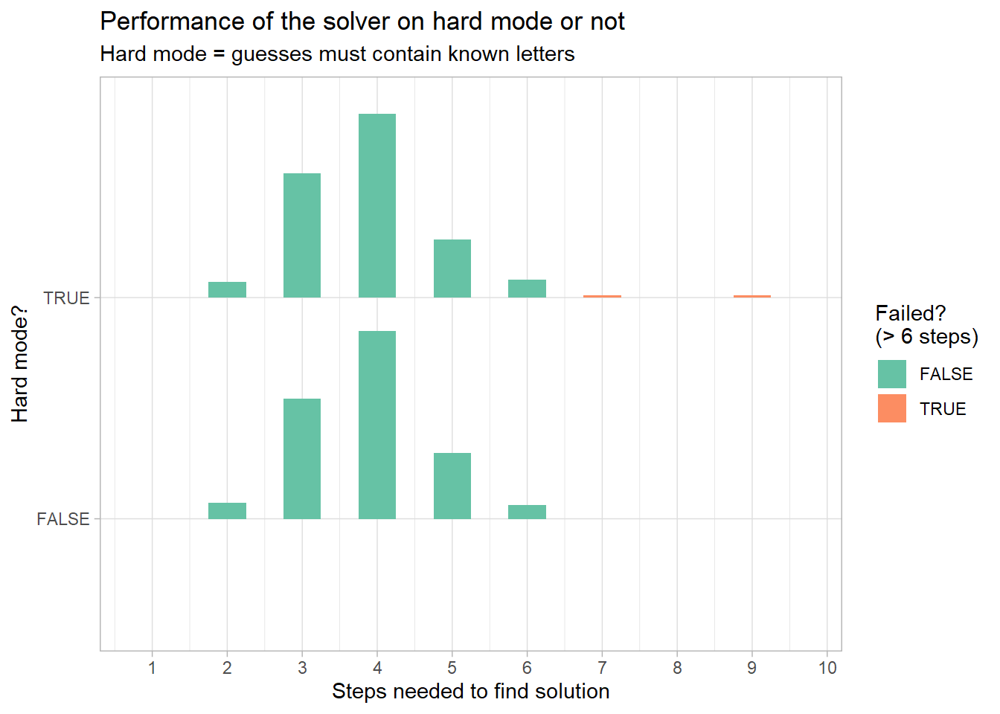

Solving Wordles
================
Matthew Kay

## Introduction

In this document I play around with solving Wordles automatically.
Probably the strategy I came up with is silly, but it seems to do an
okay job, so I figured I’d write this up!

I rely heavily on [coolbutuseless](https://twitter.com/coolbutuseless)’s
[wordle](https://github.com/coolbutuseless/wordle) package.

Packages needed:

``` r
library(dplyr)
library(tidyr)
library(purrr)
library(ggplot2)

# install via devtools::install_github("coolbutuseless/wordle")
library(wordle)

theme_set(theme_light())
```

## General strategy

I’m going to take a pretty simple approach:

-   We’ll only look one word ahead at a time.

-   We’ll score words based on two things (essentially based on the
    green and yellow squares Wordle gives as feedback):

    1.  `equal_score`: The expected number of letters in the word in the
        correct position, given the remaining possible words.

    2.  `in_score`: The expected number of **new** letters found
        anywhere in the word, given the remaining possible words. In a
        previous version this was just the expected number of letters
        founds anywhere in the word, but I updated this heuristic to
        only look for new letters to promote exploration.

-   We’ll calculate these expectations assuming the words chosen by
    Wordle follow some distribution based on word frequencies in the
    English language (though actually we’ll check this too!).

-   We’ll also (later) introduce a heuristic for picking between these
    two scores when needed.

## Getting a word frequency distribution

Given all that, our first step will be to get a frequency distribution
of words to weight our expectations by.

Helpfully, the `{wordle}` package already includes the full dictionary
of 5-letter strings that Wordle considers to be “words”:

``` r
helper = WordleHelper$new(nchar = 5)
str(helper$words)
```

    ##  chr [1:12972] "aahed" "aalii" "aargh" "aarti" "abaca" "abaci" "aback" ...

Using two different data sources, let’s hack together a rough table of
English word frequencies. Here I am using a [corpus of commonly-used
words from the Google Web Trillion Word Corpus]() and the [BNC word
frequency list](https://martinweisser.org/corpora_site/word_lists.html),
and just naively stuffing them together with equal weights:

``` r
freq = tibble(word = helper$words) %>%
  left_join(read.csv("unigram_freq.csv"), by = "word") %>%
  left_join(
    read.csv("bnc_freq.csv") %>%
      group_by(word) %>%
      summarise(count = sum(count)),
    by = "word"
  ) %>%
  mutate(
    count.x = ifelse(is.na(count.x), 0, count.x),
    count.y = ifelse(is.na(count.y), 0, count.y),
    count = count.x/sum(count.x) + count.y/sum(count.y),
    # need a nonzero count for all words, so just assume words that don't
    # appear at all are half as frequent as the least frequent appearing word
    count = ifelse(count == 0, min(count[count != 0])/2, count),
    # rough log of the count shifted above 0
    # (we'll want this later)
    log_count = log(count) - log(min(count)/2)
  )

freq %>%
  arrange(-count)
```

    ## # A tibble: 12,972 x 5
    ##    word     count.x count.y  count log_count
    ##    <chr>      <dbl>   <dbl>  <dbl>     <dbl>
    ##  1 which  810514085    3719 0.0554      13.9
    ##  2 there  701170205    3278 0.0486      13.8
    ##  3 their  782849411    2608 0.0423      13.6
    ##  4 about 1226734006    1971 0.0420      13.6
    ##  5 would  572644147    2551 0.0383      13.5
    ##  6 other  978481319    1421 0.0317      13.4
    ##  7 could  302311431    1683 0.0241      13.1
    ##  8 these  541003982    1254 0.0229      13.0
    ##  9 first  578161543    1193 0.0228      13.0
    ## 10 after  372948094    1160 0.0192      12.9
    ## # ... with 12,962 more rows

## How are Wordle words picked?

I don’t know how Wordle words are picked, but a reasonable
simplification might be to assume they follow some distribution that has
some relationship to their frequency in English. So let’s compare the
frequency of the past answers to their frequencies in English.

### Past answers (SPOILERS!)

As it happens, you can grab past answers from the Wordle source code
(and future answers! though we won’t do that). Answers so far are:

``` r
past_answers = c("cigar","rebut","sissy","humph","awake","blush","focal","evade","naval","serve","heath","dwarf","model","karma","stink","grade","quiet","bench","abate","feign","major","death","fresh","crust","stool","colon","abase","marry","react","batty","pride","floss","helix","croak","staff","paper","unfed","whelp","trawl","outdo","adobe","crazy","sower","repay","digit","crate","cluck","spike","mimic","pound","maxim","linen","unmet","flesh","booby","forth","first","stand","belly","ivory","seedy","print","yearn","drain","bribe","stout","panel","crass","flume","offal","agree","error","swirl","argue","bleed","delta","flick","totem","wooer","front","shrub","parry","biome","lapel","start","greet","goner","golem","lusty","loopy","round","audit","lying","gamma","labor","islet","civic","forge","corny","moult","basic","salad","agate","spicy","spray","essay","fjord","spend","kebab","guild","aback","motor","alone","hatch","hyper","thumb","dowry","ought","belch","dutch","pilot","tweed","comet","jaunt","enema","steed","abyss","growl","fling","dozen","boozy","erode","world","gouge","click","briar","great","altar","pulpy","blurt","coast","duchy","groin","fixer","group","rogue","badly","smart","pithy","gaudy","chill","heron","vodka","finer","surer","radio","rouge","perch","retch","wrote","clock","tilde","store","prove","bring","solve","cheat","grime","exult","usher","epoch","triad","break","rhino","viral","conic","masse","sonic","vital","trace","using","peach","champ","baton","brake","pluck","craze","gripe","weary","picky","acute","ferry","aside","tapir","troll","unify","rebus","boost","truss","siege","tiger","banal")
```

Let’s see if we can figure out how they relate to the frequency
distribution of words in English.

Here are the frequencies of the selected words compared to their
frequencies in English and the scaled log of their frequencies:

``` r
freq %>%
  mutate(count_rank = rank(-count)) %>%
  filter(word %in% past_answers) %>%
  ggplot(aes(x = count_rank)) +
  geom_histogram(aes(y = stat(ncount)), bins = 100) +
  geom_line(aes(y = count, color = method), data = . %>% 
    pivot_longer(c(count, log_count), names_to = "method", values_to = "count") %>%
    group_by(method) %>%
    mutate(count = count/max(count))
  ) +
  labs(
    x = "Past Wordle answers, ranked by English-language frequency",
    y = "Frequency (scaled)",
    color = "English-language\ncomparison"
  )
```



It would appear that the probability of a word being chosen is closer to
the log of its frequency than its actual frequency. This is probably a
sensible word selection strategy for making a good game, since it makes
the puzzle not just a bunch of very common words (but also not just a
bunch of rare words). So we may want to weight expectations by log
frequency, not frequency (we’ll actually try both and see).

In the meantime, we’ll keep both the frequency and log frequency as
lookup tables for later…

``` r
english_freq_table = freq$count
names(english_freq_table) = freq$word

english_log_freq_table = freq$log_count
names(english_log_freq_table) = freq$word
```

## Scoring guesses

Here’s a relatively naive scoring function for possible guesses. It
looks at every possible word and scores it according to a weighted sum
of two expectations: the expected number of letters in the correct
position and the expected number of new letters discovered to be in the
word (i.e. letters that weren’t already known about). It calculates
expectations over a provided frequency distribution of possible words.

``` r
score_words = function(helper, weight = 0.5, freq_table = english_log_freq_table, guess_words = NULL, explore_threshold = NA) {
  words = helper$words
  
  # get word frequencies
  word_freq = if (is.null(freq_table)) {
    rep(1, length(words))
  } else{
    freq_table[words]
  }
  word_freq = word_freq / sum(word_freq)

  # matrix of letters in each word
  word_letters = strsplit(words, "")
  word_letters_matrix = simplify2array(word_letters)
  
  # words to be used for guessing --- if not provided, assume we're doing "hard mode";
  # i.e. can only guess from the remaining possible words
  if (is.null(guess_words)) {
    guess_words = words
    guess_word_letters = word_letters
    guess_word_letters_matrix = word_letters_matrix
  } else {
    guess_word_letters = strsplit(guess_words, "")
    guess_word_letters_matrix = simplify2array(guess_word_letters)
  }
  
  # first part of score: expected number of letters in the correct position
  equal_score = vapply(guess_word_letters, \(w) sum(colSums(w == word_letters_matrix) * word_freq), numeric(1))
  
  # second part of score: expected number of new letters discovered to be in the word
  known_letters = union(unlist(strsplit(helper$wrong_spot, "")), helper$exact)
  unknown_letters = setdiff(letters, known_letters)
  word_letters_mask_matrix = vapply(word_letters, \(w) unknown_letters %in% w, logical(length(unknown_letters)))
  guess_word_letters_mask_matrix = vapply(guess_word_letters, \(w) unknown_letters %in% w, logical(length(unknown_letters)))
  in_score = colSums((word_freq * t(word_letters_mask_matrix)) %*% guess_word_letters_mask_matrix)

  # if we have at least three similar "top" contenders according to equal_score
  # "explore" for one round (this is off by default, we'll get to it later...)
  sorted_equal_score = sort(equal_score, decreasing = TRUE)
  if (isTRUE(sorted_equal_score[1] / sorted_equal_score[3] < explore_threshold)) weight = 0
  
  tibble(words = guess_words, equal_score, in_score, score = weight*equal_score + (1 - weight)*in_score) %>%
    arrange(-score)
}
```

For example, we can ask it for an initial guess by scoring all possible
words given that we have made no guesses so far:

``` r
score_words(helper, guess_words = wordle_dict)
```

    ## # A tibble: 12,972 x 4
    ##    words equal_score in_score score
    ##    <chr>       <dbl>    <dbl> <dbl>
    ##  1 tares       0.791     1.89  1.34
    ##  2 lares       0.772     1.88  1.33
    ##  3 rales       0.748     1.88  1.31
    ##  4 rates       0.733     1.89  1.31
    ##  5 nares       0.747     1.86  1.30
    ##  6 cares       0.806     1.80  1.30
    ##  7 tales       0.767     1.82  1.29
    ##  8 dares       0.776     1.81  1.29
    ##  9 pares       0.792     1.77  1.28
    ## 10 tores       0.780     1.78  1.28
    ## # ... with 12,962 more rows

So it suggests “tares” as a first word to try. Let’s play against a
particular word and see how many steps it takes to get it:

``` r
play_against = function(word, first_guess = NULL, quiet = FALSE, ...) {
  helper = WordleHelper$new(nchar = nchar(word))
  game = WordleGame$new(helper$words, target_word = word)
  
  if (!is.null(first_guess)) {
    helper$update(first_guess, game$try(first_guess, quiet = quiet))
  }
  
  while (!game$is_solved()) {
    guess = score_words(helper, ...)$words[[1]]
    helper$update(guess, game$try(guess, quiet = quiet))
  }
  
  game$attempts
}
```

Let’s try it out:

``` r
play_against("slump")
```

    ## [38;5;232m[48;5;249m t [48;5;249m a [48;5;249m r [48;5;249m e [48;5;226m s [39m[49m 
    ## [38;5;232m[48;5;46m s [48;5;249m o [48;5;249m i [48;5;226m l [48;5;249m y [39m[49m 
    ## [38;5;232m[48;5;46m s [48;5;46m l [48;5;46m u [48;5;46m m [48;5;46m p [39m[49m

    ## [1] "tares" "soily" "slump"

(This doesn’t seem to render properly in Github markdown, so here’s a
screenshot:)



Not bad!

## Testing different strategies

There are two obvious parameters here: the `weight` between the two
expectations and the word frequency table used. Let’s try both in
various combinations:

``` r
strategy_steps = 
  map_dfr(list(freq = english_freq_table, log_freq = english_log_freq_table), .id = "table", \(freq_table) {
    map_dfr(seq(0, 1, length.out = 21), \(weight) {
      cat("Scoring weight = ", weight, "\n")
      # get the first guess here since it takes the longest
      first_guess = score_words(WordleHelper$new(nchar = nchar(past_answers[[1]])), weight = weight)$words[[1]]
      
      map_dfr(past_answers, \(word) data.frame(
        word, 
        weight,
        steps = tryCatch(
          length(play_against(
            word, first_guess = first_guess, 
            weight = weight, freq_table = freq_table,
            quiet = TRUE
          )),
          error = function(e) NA
        )
      ))
    })
  })
```

Comparing the the various strategies…

``` r
strategy_steps %>%
  mutate(table = forcats::fct_recode(table,
    "English frequency" = "freq",
    "log(English frequency)" = "log_freq"
  )) %>%
  group_by(weight, table) %>%
  summarise(steps = mean(steps, na.rm = TRUE), .groups = "drop") %>%
  ggplot(aes(weight, steps, color = table)) +
  geom_line() +
  labs(
    title = "Comparison of different strategies for picking the next word",
    x = "Weight between E(# letters in correct position) and\nE(# unique letters anywhere in word)",
    color = "Word weighting",
    y = "Average number of steps until correct answer"
  )
```



It seems like an equal weight between both expectations (using the log
frequency table) is not too shabby.

Looking in more detail at the distribution of numbers of steps when
`weight == 0.5`, it looks like using the log frequency weighting only
offers a very slight improvement overall:

``` r
strategy_steps %>%
  mutate(table = forcats::fct_recode(table,
    "English frequency" = "freq",
    "log(English frequency)" = "log_freq"
  )) %>%
  filter(weight == 0.5) %>%
  ggplot(aes(x = steps, color = table)) +
  geom_freqpoly(binwidth = 1, na.rm = TRUE) +
  scale_x_continuous(breaks = 1:10)
```



One thing that is problematic is that there remain some words that
require more than 6 guesses (which is a “loss” in Wordle). Let’s see if
we can fix that…

## Allowing “exploration” as needed on Easy Mode

Wordle’s default “easy mode” allows you to guess words that don’t
contain the letters you’ve found so far. The solver by default plays on
“hard mode”, but we can let it play on “easy mode” by tweaking two
parameters:

-   Setting `guess_words` determines the dictionary used for guesses. By
    default the remaining possible words are used (i.e. the words
    containing the letters found so far). By setting `guess_words` to
    the full dictionary (`wordle::wordle_dict`), we can allow the solver
    to guess any word in any round.

-   Setting `explore_threshold` to a value greater than 1 will allow the
    solver to trigger the “explore” mode. In a given round, if the ratio
    of `equal_score` (the expected number of correct letters) between
    the highest-ranked guess according to `equal_score` and the
    third-highest-ranked guess is less than `explore_threshold`, then
    `equal_score` is ignored and `in_score` (the expected number of new
    letters found) is used by itself for that round. The idea here is
    that if the top three words all have similar likelihood of being
    correct, it’s better to try a different, single word that might
    distinguish between those three (taking two rounds: the
    “exploration” guess plus guessing the remaining word) than needing
    to guess all three words. I’ve found a value of `1.01` words well
    for this parameter, but haven’t played with it deeply.

You can see the difference by picking one of the particularly bad words
from “hard mode”. For example:

``` r
strategy_steps %>%
  filter(weight == 0.5, table == "log_freq") %>%
  arrange(-steps) %>%
  head(10)
```

    ##       table  word weight steps
    ## 1  log_freq hatch    0.5     9
    ## 2  log_freq surer    0.5     7
    ## 3  log_freq evade    0.5     6
    ## 4  log_freq stool    0.5     6
    ## 5  log_freq floss    0.5     6
    ## 6  log_freq unfed    0.5     6
    ## 7  log_freq booby    0.5     6
    ## 8  log_freq crass    0.5     6
    ## 9  log_freq wooer    0.5     6
    ## 10 log_freq parry    0.5     6

Let’s look at “hatch”:

``` r
play_against("hatch")
```

    ## [38;5;232m[48;5;226m t [48;5;46m a [48;5;249m r [48;5;249m e [48;5;249m s [39m[49m 
    ## [38;5;232m[48;5;249m n [48;5;46m a [48;5;46m t [48;5;46m c [48;5;46m h [39m[49m 
    ## [38;5;232m[48;5;249m w [48;5;46m a [48;5;46m t [48;5;46m c [48;5;46m h [39m[49m 
    ## [38;5;232m[48;5;249m m [48;5;46m a [48;5;46m t [48;5;46m c [48;5;46m h [39m[49m 
    ## [38;5;232m[48;5;249m p [48;5;46m a [48;5;46m t [48;5;46m c [48;5;46m h [39m[49m 
    ## [38;5;232m[48;5;249m b [48;5;46m a [48;5;46m t [48;5;46m c [48;5;46m h [39m[49m 
    ## [38;5;232m[48;5;249m l [48;5;46m a [48;5;46m t [48;5;46m c [48;5;46m h [39m[49m 
    ## [38;5;232m[48;5;249m c [48;5;46m a [48;5;46m t [48;5;46m c [48;5;46m h [39m[49m 
    ## [38;5;232m[48;5;46m h [48;5;46m a [48;5;46m t [48;5;46m c [48;5;46m h [39m[49m

    ## [1] "tares" "natch" "watch" "match" "patch" "batch" "latch" "catch" "hatch"



The solver does a poor job, because it is stuck guessing words that end
in “atch”, and the solution (“hatch”) happens to be rarer than most of
the other words ending in “atch”, so they are chosen first.

By allowing the solver to dynamically “explore” when it has a set of
similarly-likely candidate guesses, it is able to eliminate a bunch of
potential “atch” words in a single guess:

``` r
play_against("hatch", explore_threshold = 1.01, guess_words = wordle_dict)
```

    ## [38;5;232m[48;5;226m t [48;5;46m a [48;5;249m r [48;5;249m e [48;5;249m s [39m[49m 
    ## [38;5;232m[48;5;249m n [48;5;46m a [48;5;46m t [48;5;46m c [48;5;46m h [39m[49m 
    ## [38;5;232m[48;5;249m b [48;5;249m l [48;5;249m i [48;5;249m m [48;5;249m p [39m[49m 
    ## [38;5;232m[48;5;249m w [48;5;46m a [48;5;46m t [48;5;46m c [48;5;46m h [39m[49m 
    ## [38;5;232m[48;5;249m c [48;5;46m a [48;5;46m t [48;5;46m c [48;5;46m h [39m[49m 
    ## [38;5;232m[48;5;46m h [48;5;46m a [48;5;46m t [48;5;46m c [48;5;46m h [39m[49m

    ## [1] "tares" "natch" "blimp" "watch" "catch" "hatch"



We can run this approach against the past answers…

``` r
helper = WordleHelper$new(nchar = 5)
first_guess = score_words(helper, explore_threshold = 1.01, guess_words = wordle_dict)$words[[1]]
explore_steps = 
  map_dfr(past_answers, \(word) {
    cat("Scoring word ", word, "\n")
    data.frame(
      word, 
      steps = tryCatch(
        length(play_against(
          word, first_guess = first_guess,
          explore_threshold = 1.01, guess_words = wordle_dict,
          quiet = TRUE
        )),
        error = function(e) NA
      )
    )
  })
```

… and see how the “easy mode” approach with exploration compares to the
“hard mode” approach:

``` r
strategy_steps %>%
  filter(table == "log_freq", weight == 0.5) %>%
  mutate(hard_mode = TRUE) %>%
  bind_rows(mutate(explore_steps, hard_mode = FALSE)) %>%
  ggplot(aes(y = hard_mode, x = steps, fill = stat(x > 6.5))) +
  ggdist::stat_histinterval(
    breaks = 2:20/2 - 0.25, 
    show_interval = FALSE,
    scale = 0.85
  ) +
  scale_x_continuous(breaks = 1:10) +
  labs(
    title = "Performance of the solver on hard mode or not",
    subtitle = "Hard mode = guesses must contain known letters",
    y = "Hard mode?",
    x = "Steps needed to find solution",
    fill = "Failed?\n(> 6 steps)"
  ) +
  scale_fill_brewer(palette = "Set2")
```



Very similar overall, except we got rid of those pesky \> 6 step
solutions!
